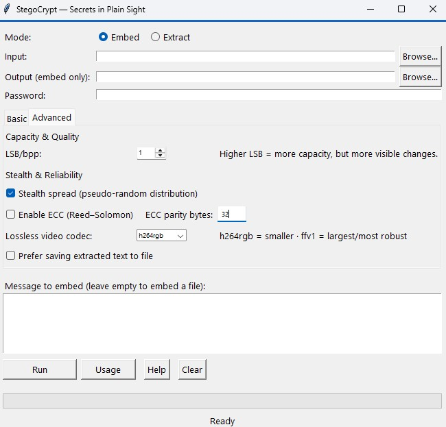

# StegoCrypt


Steganography hides the existence of data, while encryption protects its content. StegoCrypt combines both — hiding encrypted messages or files inside images or videos using password-protected, pixel-level steganography.

✔ GUI for Windows • macOS • Linux  
✔ Video & image support (lossless)  
✔ Optional CLI  
✔ Stealth mode (spread) + optional ECC  
✔ FFV1 & H264RGB lossless pipelines for reliable extraction 

[](../../releases/latest)
  
---

**Note on security**: Even if you use a weak password such as "hello", an attacker who doesn’t know there’s anything hidden may not look for it. That’s the beauty of steganography — security through obscurity at the visual/statistical level.
However, if the adversary suspects steganography and runs tools like StegExpose or Chi-square tests, weakly protected data can be detected, even if not decrypted. Once detected, brute-forcing a weak password becomes trivial.
Use **strong passwords** and keep LSB at **1** unless you explicitly need more capacity.

---

# ⭐ Features

### **Core**
- Hide **text or entire files** inside images or videos  
- AES-GCM encryption with password  
- Automatic payload formatting + metadata  
- Supports:
  - Images: **PNG, JPG, JPEG, BMP, GIF, TIFF**  
  - Videos: **MP4, MKV, AVI, MOV** (lossless)

### **GUI**
- **Basic tab** — simple, beginner-friendly  
- **Advanced tab** — full control:
  - LSB/bpp (1–3)
  - Stealth Spread (pseudo-random pixel distribution)
  - Reed–Solomon ECC (optional)
  - Lossless codec selector: `ffv1` or `h264rgb`
  - Option to auto-save extracted text

### **Video Stego Pipeline**
- Lossless write via FFmpeg:
  - `ffv1` — maximal fidelity (recommended)
  - `h264rgb` — smaller outputs, still pixel-safe
- Post-embed **pixel-level verification** ensures reliable extraction

### **CLI (optional)**
- Full embed/extract without the GUI  
- Automatically prints UTF-8 or writes binary when needed

---

### Main Interface


---

## Download

➡️ **[Get the latest StegoCrypt installer for Windows, MacOS or Linux](../../releases/latest)**

---

# 🔧 Install ffmpeg (required for video)

**Why ffmpeg?** 
StegoCrypt uses ffmpeg to read/write video frames losslessly (`ffv1` / `h264rgb`), preserve LSB integrity and verify outputs. Without it, video stego is limited or unavailable (images still work).

```
#Linux (Debian/Ubuntu)
sudo apt install ffmpeg

#macOS (using Homebrew)
brew install ffmpeg

#Windows (using Chocolatey)
choco install ffmpeg
```

---

## Run from source (Windows/macOS/Linux)

```bash
# from repo root
python -m venv .venv

# Windows:
.\.venv\Scripts\Activate.ps1

# macOS/Linux:
source .venv/bin/activate

pip install -r requirements.txt

# Run in CLI (will start up GUI interface)
python main.py
```


If you prefer to run directly in CLI, here are some examples:
```
# Embed text into an image
python stego_cli.py embed -i cover.png -o out.png -p "secret123" -m "Hello world"

# Extract (prints UTF-8 or writes binary if needed)
python stego_cli.py extract -i out.png -p "secret123"
```

---

**Documentation**

- For more info on CLI usage, please refer to the manual at [/docs/CLIOpsManual.pdf](/docs/CLIOpsManual.pdf)
- For information on mathematical detail behind this project, please see [docs/MathematicalDescription.pdf](docs/MathematicalDescription.pdf)

---

## 🗺 Roadmap

- [ ] Drag-and-drop support  
- [ ] Password strength indicator  
- [ ] Batch embedding (multiple files at once)  
- [ ] GPU-accelerated video pipeline (optional)  
- [ ] Theme selector (light/dark)  
- [ ] Built-in steganalysis resistance testing tools  
- [ ] Plugin system for custom codecs or algorithms 
